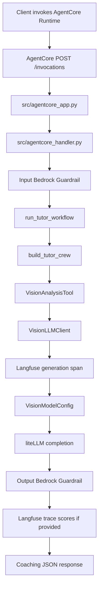

# My JEE Tutor Agent Technical Document

## 1. Project Overview

`my-jee-tutor-agent` is an Amazon Bedrock AgentCore Runtime application that analyzes IIT JEE question-attempt images and returns coaching-oriented feedback. The only runtime entrypoint is `src/agentcore_app.py`.

The code is split by responsibility:

- Runtime adapter: AgentCore app setup
- Invocation boundary: payload validation and response shaping
- Workflow orchestration: CrewAI kickoff
- Crew assembly: CrewAI object composition
- Tutor components: tool, agent, and task factories
- Model access: LiteLLM request construction and model configuration
- Runtime safety: Bedrock ApplyGuardrail checks around the custom agent
- Observability: Langfuse spans, generations, prompt links, and evaluation scores
- Prompt content: prompt strings only

## 2. Request Flow



## 3. Project Structure

```text
my-jee-tutor-agent/
+-- src/
|   +-- agentcore_app.py
|   +-- agentcore_handler.py
|   +-- Dockerfile
|   +-- config/
|   |   +-- llm.toml
|   +-- agents/
|       +-- tutor_agent/
|           +-- __init__.py
|           +-- crew.py
|           +-- factories.py
|           +-- llm_client.py
|           +-- model_config.py
|           +-- config_loader.py
|           +-- guardrails.py
|           +-- observability.py
|           +-- prompts.py
|           +-- tools.py
|           +-- workflow.py
+-- terraform/
|   +-- main.tf
|   +-- providers.tf
|   +-- variables.tf
+-- pyproject.toml
+-- poetry.lock
+-- README.md
```

## 4. Runtime Boundary

### `src/agentcore_app.py`

Creates the `BedrockAgentCoreApp` and registers the single AgentCore entrypoint. It delegates immediately to `handle_tutor_invocation(...)` so the runtime file stays thin.

### `src/agentcore_handler.py`

Owns request/response concerns:

- validates incoming payloads with Pydantic
- accepts either `image_data_uri` or a structured `media` image payload
- resolves `question_context` from `question_context` or `prompt`
- applies optional Bedrock Guardrails before and after the tutor workflow
- returns either `{"analysis": "..."}` or a validation error response

This file is the boundary between AgentCore JSON payloads and the tutor workflow API.

## 5. Tutor Agent Package

### `workflow.py`

Defines `run_tutor_workflow(...)`. It is the domain-facing API for running the tutor agent. It accepts an image data URI, optional question context, and an optional injected `VisionLLMClient`.

### `crew.py`

Builds the CrewAI `Crew`. It composes the vision tool, tutor agent, and diagnosis task, then configures sequential execution.

### `tools.py`

Defines tool-level concerns:

- `VisionInput`
- `VisionAnalysisTool`
- `build_vision_tool(...)`

The tool delegates LLM calls to an injected `VisionLLMClient`, keeping CrewAI integration separate from model access.

### `factories.py`

Defines CrewAI object factories:

- `build_tutor_agent(...)`
- `build_diagnosis_task(...)`

This keeps agent/task construction separate from the tool implementation.

### `prompt_provider.py`

Resolves all behavior-shaping prompts. Langfuse is used when configured and available; otherwise the provider returns local fallback text from `prompts.py`. This keeps prompt management centralized and prevents CrewAI factories or LLM code from knowing where prompt text came from.

### `llm_client.py`

Owns LiteLLM request construction and response extraction. It asks `VisionModelConfig` for provider settings and completion options, builds the multimodal message payload, opens a Langfuse generation span when enabled, calls `litellm.completion(...)`, and returns response text.

### `model_config.py`

Owns model configuration resolution. Defaults come from `src/config/llm.toml`, while environment variables can override deployment-specific values:

- `bedrock/...` and `amazon/...` use AWS IAM credentials from AgentCore
- `openai/...` uses `OPENAI_API_KEY` or `LITELLM_API_KEY`
- `gemini/...` and `google/...` use `GOOGLE_API_KEY` or `LITELLM_API_KEY`
- all other providers use `LITELLM_API_KEY`
- `LITELLM_BASE_URL` can override `litellm.api_base`
- `VISION_MODEL` can override `vision.model`
- `LLM_CONFIG_FILE` can point to a different TOML config file

### `config_loader.py`

Loads the TOML config file and exposes section-level values to the model configuration layer.

### `guardrails.py`

Owns runtime Bedrock Guardrails integration through the independent `ApplyGuardrail` API:

- resolves guardrail settings from `[guardrails]` or environment variables
- checks input text and png/jpeg image payloads before CrewAI runs
- checks the final analysis before it is returned
- extracts non-sensitive PII type labels from Bedrock sensitive information assessments
- fails closed by default when guardrails are configured but unavailable

PII detection is configured in the Bedrock guardrail's sensitive information policy. The runtime passes content to `ApplyGuardrail`; Bedrock decides whether to block, anonymize, or allow configured PII entities and custom regex matches. The app reports only PII type labels, not matched values.

### `observability.py`

Owns the Langfuse integration:

- starts a root span for each AgentCore invocation
- starts a generation span around each LiteLLM call
- fetches managed prompts from Langfuse
- records optional evaluation scores on the current trace
- falls back to local behavior when Langfuse credentials are not configured

### `src/config/llm.toml`

Default non-secret LLM settings:

```toml
[vision]
model = "gemini/gemini-3-flash-preview"

[completion]
temperature = 0.2
```

Runtime guardrail settings:

```toml
[guardrails]
enabled = false
identifier = ""
version = "DRAFT"
output_scope = "INTERVENTIONS"
fail_closed = true
include_image = true
```

Additional LiteLLM options can be added without code changes:

```toml
[completion]
temperature = 0.2
top_p = 0.9
max_tokens = 1200
timeout = 60
```

Langfuse settings:

```toml
[langfuse]
enabled = true
trace_name = "jee-tutor-agentcore-invocation"
generation_name = "vision-question-analysis"
flush_after_invocation = false

[langfuse.prompts]
vision_system = "jee-tutor-vision-system-prompt"
tutor_agent_goal = "jee-tutor-agent-goal"
tutor_agent_backstory = "jee-tutor-agent-backstory"
diagnosis_task_description = "jee-tutor-diagnosis-task-description"
diagnosis_task_expected_output = "jee-tutor-diagnosis-task-expected-output"
```

### `prompts.py`

Stores local fallback prompt text and stable code-owned labels only. Editing production prompt behavior should usually happen in Langfuse; editing fallbacks or application contracts happens here.

### `__init__.py`

Exports the package API used by external modules.

## 6. Infrastructure

### `terraform/providers.tf`

Configures:

- `aws` for IAM and ECR
- `awscc` for Bedrock AgentCore Runtime resources

### `terraform/variables.tf`

Defines deployment inputs:

- `aws_region`
- `project_name`
- `agentcore_image_uri`
- provider/API key variables
- Langfuse API key variables

### `terraform/main.tf`

Creates:

- ECR repository for the AgentCore image
- Bedrock Guardrail with sensitive-information, harmful-content, and profanity policies
- AgentCore runtime IAM role
- inline IAM policy for ECR pull, logs, metrics, X-Ray, and Bedrock model invocation
- inline IAM permission for `bedrock:ApplyGuardrail`
- Bedrock AgentCore Runtime
- default Bedrock AgentCore Runtime endpoint
- Langfuse and guardrail environment variables for observability, prompt management, scoring, and safety

`terraform/guardrails.tf` owns the default guardrail. `terraform/main.tf` injects its `guardrail_id` as `BEDROCK_GUARDRAIL_ID`, and `src/agents/tutor_agent/guardrails.py` reads that environment variable before calling `bedrock-runtime.ApplyGuardrail`.

## 7. Deployment Shape

1. Apply Terraform enough to create or discover the ECR repository.
2. Build the image from `src/Dockerfile`.
3. Push the image to ECR.
4. Apply Terraform with `agentcore_image_uri` set to the pushed image URI.
5. Invoke the AgentCore runtime endpoint with an image payload.

## 8. Invocation Payloads

Preferred:

```json
{
  "image_data_uri": "data:image/png;base64,...",
  "question_context": "Optional context"
}
```

Alternative:

```json
{
  "media": {
    "type": "image",
    "format": "png",
    "data": "base64..."
  },
  "prompt": "Optional context"
}
```
