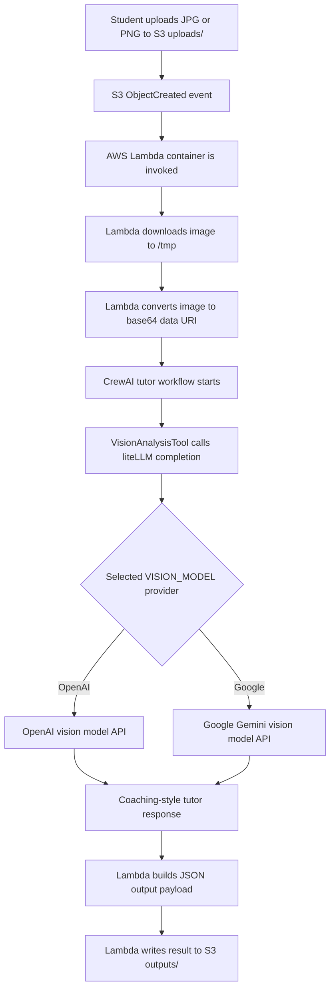

# My JEE Tutor Agent Technical Document

## 1. Project Overview

`my-jee-tutor-agent` is a serverless, AI-powered tutoring system for IIT JEE preparation. It processes a student's uploaded image of a failed Physics, Chemistry, or Mathematics attempt, analyzes the mistake using a vision-capable large language model, and writes coaching-oriented feedback back to Amazon S3.

The project combines:
- AWS Lambda packaged as a Docker container
- Amazon S3 for event-driven ingestion and output storage
- Amazon ECR for container image hosting
- Terraform for infrastructure provisioning
- CrewAI for agent orchestration
- liteLLM for model routing across OpenAI and Google APIs
- GitHub Actions for CI/CD automation

## 2. Business Use Case

A student uploads an image into the `uploads/` prefix of an S3 bucket. The image can contain a handwritten or typed question attempt. The system analyzes the work to determine:
- the subject and likely topic
- whether the failure came from a conceptual error or a calculation error
- what evidence in the attempt supports that diagnosis
- what hints should be given next without revealing the entire answer

The result is saved under the `outputs/` prefix in the same bucket as a JSON document.

## 3. High-Level Architecture

### Core Components

- **Amazon S3**
  - Stores uploaded question images in `uploads/`
  - Stores generated analysis payloads in `outputs/`
  - Emits object-created events for `.jpg` and `.png` uploads

- **AWS Lambda**
  - Triggered by S3 object creation events
  - Downloads the image into temporary local storage
  - Converts the image to a base64 data URI
  - Invokes the CrewAI tutor workflow
  - Uploads the analysis result to S3

- **CrewAI Agent Layer**
  - Defines an IIT JEE Instructor persona
  - Uses a tool-backed task to force image analysis through a vision-capable LLM
  - Produces pedagogical output rather than a direct final answer

- **liteLLM SDK**
  - Routes model calls to the configured provider
  - Supports OpenAI models such as `openai/gpt-4o`
  - Supports Google Gemini models such as `gemini/gemini-1.5-pro`
  - Chooses API credentials based on the selected model

- **Terraform**
  - Provisions S3, ECR, Lambda, IAM, and event notifications
  - Injects runtime environment variables into Lambda
  - Applies least-privilege access for S3 and CloudWatch Logs

- **GitHub Actions**
  - Runs lint checks in pull requests
  - Builds and pushes the Lambda image on `main`
  - Applies Terraform after image publication

## 4. End-to-End Request Flow



## 5. Runtime Execution Sequence

### Step 1. Image Upload

A user uploads a `.jpg` or `.png` object into the S3 path:

```text
s3://<bucket-name>/uploads/<filename>
```

### Step 2. S3 Event Notification

Terraform configures S3 notifications for:
- prefix: `uploads/`
- suffix: `.jpg`
- suffix: `.png`

These events invoke the Lambda function.

### Step 3. Lambda Ingestion

The Lambda handler in `src/main.py`:
- reads the S3 event payload
- validates that the object is under `uploads/`
- downloads the image with `boto3`
- builds a data URI from the image content

### Step 4. CrewAI Tutor Execution

The tutor workflow in `src/agents/tutor_agent.py` creates:
- an **Agent** with an IIT JEE Instructor persona
- a **Task** that enforces a structured tutoring response
- a **VisionAnalysisTool** that invokes `litellm.completion(...)`

### Step 5. Model Routing with liteLLM

The `VisionAnalysisTool` determines provider settings based on `VISION_MODEL`.

Examples:

```text
VISION_MODEL=openai/gpt-4o
OPENAI_API_KEY=...
```

```text
VISION_MODEL=gemini/gemini-1.5-pro
GOOGLE_API_KEY=...
```

Fallback behavior:
- if provider-specific keys are not set, `LITELLM_API_KEY` can be used as a shared fallback
- `LITELLM_BASE_URL` can point to a LiteLLM proxy if needed

### Step 6. Output Persistence

The Lambda function writes a JSON payload similar to:

```json
{
  "source_bucket": "example-bucket",
  "source_key": "uploads/problem-01.png",
  "destination_bucket": "example-bucket",
  "output_key": "outputs/problem-01.json",
  "analysis": "Subject and topic...",
  "request_id": "aws-request-id"
}
```

## 6. Project Structure

```text
my-jee-tutor-agent/
├── .github/workflows/
│   ├── ci.yml
│   └── cd.yml
├── src/
│   ├── agents/
│   │   └── tutor_agent.py
│   ├── main.py
│   └── Dockerfile
├── terraform/
│   ├── main.tf
│   ├── providers.tf
│   └── variables.tf
├── pyproject.toml
├── poetry.lock
├── poetry.toml
└── README.md
```

## 7. Important Source Files

### `src/main.py`

Responsibilities:
- Lambda entrypoint: `lambda_handler(event, context)`
- S3 event parsing
- file download and temporary storage
- image-to-data-URI conversion
- invocation of the tutoring workflow
- upload of the generated JSON result

### `src/agents/tutor_agent.py`

Responsibilities:
- defines the CrewAI agent persona
- defines the tutor task prompt shape
- encapsulates `liteLLM` SDK usage in `VisionAnalysisTool`
- maps `VISION_MODEL` to the right API key source

### `terraform/main.tf`

Responsibilities:
- creates S3 bucket and encryption settings
- creates ECR repository
- creates Lambda function from a container image
- creates IAM role and least-privilege policy
- creates S3 notification rules for `.jpg` and `.png`

### `.github/workflows/cd.yml`

Responsibilities:
- authenticates to AWS
- initializes Terraform backend
- ensures ECR exists
- builds and pushes the Lambda image
- updates infrastructure with the produced image URI

## 8. Infrastructure Design

### S3

The S3 bucket is configured with:
- versioning enabled
- public access blocked
- SSE-S3 encryption enabled

### Lambda

The Lambda function is configured with:
- package type: `Image`
- timeout: `300 seconds`
- memory: `1024 MB`
- environment variables for model/provider configuration

### ECR

The Lambda image is stored in Amazon ECR with image scanning enabled on push.

### IAM

The Lambda execution role is intentionally restricted to:
- `s3:GetObject` on `uploads/*`
- `s3:PutObject` on `outputs/*`
- CloudWatch Logs permissions for runtime logging

## 9. CI/CD Design

### CI Workflow

The CI workflow:
- checks out the repository
- installs dependencies with Poetry
- runs `ruff` against `src`

### CD Workflow

The CD workflow:
1. assumes an AWS IAM role from GitHub Actions
2. runs `terraform init`
3. creates the ECR repository if needed
4. reads the ECR repository URL from Terraform outputs
5. builds the Lambda container image
6. pushes the image to ECR
7. runs Terraform again with the real image URI

This two-phase apply avoids a cold-start dependency loop where Lambda expects an image before the repository exists.

## 10. Environment Variables

### Lambda Runtime Variables

- `VISION_MODEL`
- `OPENAI_API_KEY`
- `GOOGLE_API_KEY`
- `LITELLM_API_KEY`
- `LITELLM_BASE_URL`
- `OUTPUT_BUCKET`
- `OUTPUT_PREFIX`

### GitHub Secrets

- `AWS_ROLE_TO_ASSUME`
- `OPENAI_API_KEY`
- `GOOGLE_API_KEY`
- `LITELLM_API_KEY`
- `LITELLM_BASE_URL`

### GitHub Repository Variables

- `AWS_REGION`
- `PROJECT_NAME`
- `VISION_MODEL`
- `TF_STATE_BUCKET`
- `TF_STATE_KEY`
- `TF_STATE_DYNAMODB_TABLE`

## 11. Security Considerations

- The Lambda IAM role is limited to exact S3 prefixes.
- Public access to the S3 bucket is blocked.
- Secrets are expected to come from GitHub Secrets and Terraform variables rather than source control.
- The Lambda container model keeps runtime packaging deterministic.
- The output is teaching-oriented and avoids directly disclosing the full solution whenever possible.

## 12. Operational Considerations

### Logging

The Lambda writes execution details into CloudWatch Logs. These logs should be used for:
- failed image parsing
- API failures from OpenAI or Google
- unexpected S3 event payloads
- latency analysis

### Performance

Potential latency contributors:
- image download size
- image encoding time
- upstream vision model response time
- cold starts for Lambda container images

### Scalability

The design scales naturally with:
- S3 event-driven invocation
- stateless Lambda execution
- managed container delivery through ECR

## 13. Current Limitations

- only `.jpg` and `.png` files are accepted through S3 triggers
- the current output format is JSON only
- there is no persistence layer beyond S3 for analytics or user history
- there is no explicit dead-letter queue yet for failed invocations
- metadata extraction from S3 object metadata is minimal

## 14. Recommended Next Enhancements

- add unit tests for Lambda event parsing and output-key generation
- add integration tests with sample S3 event payloads
- add a DLQ or failure destination for Lambda
- add structured observability with metrics and tracing
- support multi-page PDF ingestion if students upload worksheets
- persist tutor sessions in DynamoDB for analytics and continuity
- add prompt guardrails for hallucination reduction and answer leakage control

## 15. Summary

This project implements a production-oriented, event-driven AI tutoring backend for IIT JEE workflows. It uses AWS serverless components for scalability, CrewAI for agent structure, and liteLLM for flexible provider routing across OpenAI and Google models. The system is designed to be secure, deployable, and straightforward to extend.
