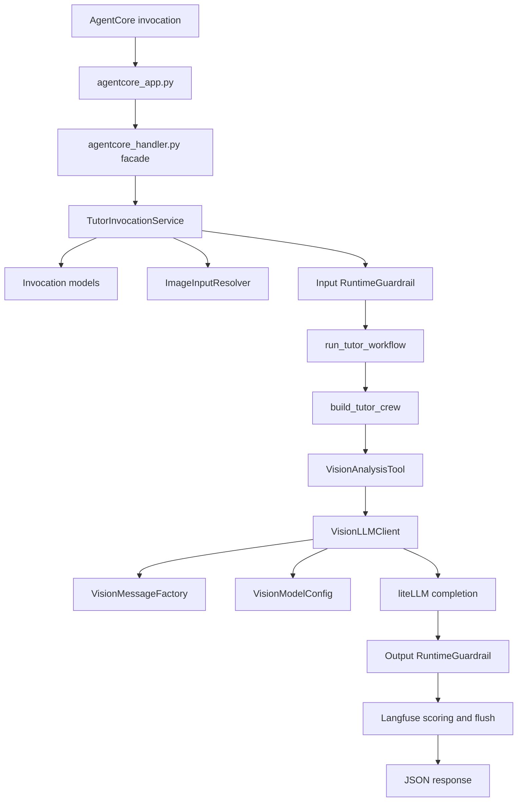

# My JEE Tutor Agent Design Document

## 1. Purpose

`my-jee-tutor-agent` is an Amazon Bedrock AgentCore Runtime application that analyzes IIT JEE attempt images and returns coaching feedback. The system is designed as a thin runtime adapter around a domain workflow, with guardrails, observability, evals, and deployment concerns kept at explicit boundaries.

The architecture favors small, replaceable components over a large handler function. This keeps the production path easy to reason about, makes tests cheaper, and lets CI/CD security checks exercise the same runtime code used by AgentCore.

## 2. Design Goals

- Keep AgentCore-specific code at the edge.
- Accept multiple image input shapes without leaking transport details into the tutor workflow.
- Apply input and output guardrails consistently around the workflow.
- Keep prompt resolution, model configuration, and LiteLLM request construction separate.
- Make core dependencies injectable for tests, evals, and future providers.
- Redact image payloads from traces and reports.
- Keep deployment, vulnerability scanning, and evals reproducible from GitHub Actions.

## 3. Non-Goals

- This repository does not implement a general tutoring platform or user database.
- It does not store uploaded images after request handling.
- It does not replace Bedrock Guardrails with local policy logic; local code only adapts request and response shapes.
- It does not define production prompt authoring workflows beyond Langfuse prompt lookup and local fallbacks.

## 4. High-Level Architecture



## 5. Layered Responsibilities

### Runtime Edge

- `src/agentcore_app.py` owns the Bedrock AgentCore app registration.
- `src/agentcore_handler.py` is a stable facade with `handle_tutor_invocation(...)`.
- The facade delegates immediately to `TutorInvocationService`, so transport code stays thin.

### Invocation Application Layer

- `src/tutor_invocation_service.py` owns the request use case.
- It validates payloads, resolves images, applies input and output guardrails, runs the workflow, records observability, and returns response dictionaries.
- Dependencies are injected through the constructor: `ImageInputResolver`, `RuntimeGuardrail`, `LangfuseObservability`, and workflow callable.

### Request Models

- `src/invocation_models.py` defines Pydantic request and response contracts.
- `TutorInvocationPayload` accepts:
  - `image_folder`
  - `image_data_uris`
  - `image_data_uri`
  - structured `media`
- `safe_trace_input()` removes image payloads before observability receives the request.

### Image Input Resolution

- `src/image_inputs.py` converts supported input shapes into a list of image data URIs.
- `ImageInputResolver` handles filesystem folder reads and structured media conversion.
- Supported folder file types are `.png`, `.jpg`, `.jpeg`, and `.webp`; files are loaded in filename order.

### Tutor Workflow

- `src/agents/tutor_agent/workflow.py` exposes `run_tutor_workflow(...)`.
- The workflow receives normalized image data URIs and optional question context.
- CrewAI-specific construction is hidden behind `build_tutor_crew(...)`.

### CrewAI Factories

- `src/agents/tutor_agent/crew.py` composes the CrewAI `Crew`.
- `src/agents/tutor_agent/factories.py` builds the tutor agent and diagnosis task.
- These factory functions isolate CrewAI object construction from runtime handling and model access.

### Vision Tool and Model Client

- `src/agents/tutor_agent/tools.py` defines the CrewAI tool schema and delegates model work.
- `VisionAnalysisTool` calls `VisionLLMClient`; it does not know provider details.
- `src/agents/tutor_agent/llm_client.py` owns LiteLLM calls.
- `VisionMessageFactory` builds the provider-neutral multimodal message payload.
- `VisionModelConfig` resolves model, API key, API base, AWS region, and completion options.

### Guardrails

- `src/agents/tutor_agent/guardrails.py` adapts content into Bedrock `ApplyGuardrail`.
- `BedrockGuardrailContentBuilder` constructs text and image content payloads.
- `RuntimeGuardrail` owns settings, client access, failure policy, and response interpretation.
- The app reports only non-sensitive PII labels, not matched PII values.

### Observability

- `src/agents/tutor_agent/observability.py` wraps Langfuse.
- If Langfuse is not configured, calls become no-ops.
- Invocation spans, generation spans, managed prompt lookup, and optional evaluation scores live here.

## 6. Patterns Applied

- Facade: `agentcore_handler.py` preserves a small public entrypoint while hiding implementation details.
- Application service: `TutorInvocationService` coordinates the invocation use case.
- Factory: CrewAI agent/task/tool creation lives in dedicated factory functions.
- Strategy by injection: guardrail, image resolver, observability, workflow, message factory, and completion function can be replaced in tests or future integrations.
- Single Responsibility Principle: request schema, image loading, orchestration, guardrail adaptation, model configuration, and provider request construction are separate modules.
- Encapsulation: image payload redaction and guardrail response parsing are owned by the components closest to those concerns.
- Dependency inversion: high-level orchestration depends on injected collaborators instead of creating all behavior inline.

## 7. Runtime Flow

1. AgentCore calls `agentcore_app.py`.
2. `handle_tutor_invocation(...)` delegates to `TutorInvocationService`.
3. Pydantic validates the JSON payload.
4. `ImageInputResolver` normalizes folder/media/data URI inputs into a list of image data URIs.
5. Langfuse invocation span starts with image fields excluded.
6. Input guardrail checks text context and supported images.
7. CrewAI runs the tutor workflow.
8. `VisionLLMClient` builds a multimodal LiteLLM request and returns analysis text.
9. Output guardrail checks the analysis.
10. Langfuse scores are recorded if provided.
11. The service returns either `{"analysis": "..."}` or `{"error": "...", "details": [...]}`.

## 8. Payload Contract

Preferred folder input:

```json
{
  "image_folder": "/app/input/attempt-images",
  "question_context": "Optional student/question context"
}
```

Multiple data URIs:

```json
{
  "image_data_uris": [
    "data:image/png;base64,...",
    "data:image/jpeg;base64,..."
  ],
  "question_context": "Optional student/question context"
}
```

Single-image compatibility:

```json
{
  "image_data_uri": "data:image/png;base64,...",
  "question_context": "Optional student/question context"
}
```

Structured media compatibility:

```json
{
  "media": {
    "type": "image",
    "format": "png",
    "data": "base64..."
  },
  "prompt": "Optional student/question context"
}
```

## 9. Configuration

Runtime model settings live in `src/config/llm.toml` and can be overridden with environment variables.

Important environment variables:

- `VISION_MODEL`
- `OPENAI_API_KEY`
- `GOOGLE_API_KEY`
- `LITELLM_API_KEY`
- `LITELLM_BASE_URL`
- `AWS_REGION`
- `AWS_DEFAULT_REGION`
- `LLM_CONFIG_FILE`
- `BEDROCK_GUARDRAIL_ENABLED`
- `BEDROCK_GUARDRAIL_ID`
- `BEDROCK_GUARDRAIL_VERSION`
- `BEDROCK_GUARDRAIL_REGION`
- `LANGFUSE_PUBLIC_KEY`
- `LANGFUSE_SECRET_KEY`
- `LANGFUSE_BASE_URL`

## 10. CI/CD Design

### CI

`ci.yml` installs dependencies, runs Ruff, and executes unit tests.

### CD

`cd.yml` performs deployment and runtime quality gates:

1. Configure AWS credentials.
2. Initialize Terraform.
3. Create or discover ECR repository.
4. Build and push the AgentCore image.
5. Apply Terraform for the AgentCore runtime and guardrail.
6. Run agent evals from `evals/jee_tutor_eval_cases.json`.
7. Run garak vulnerability and guardrail probing through `scripts/garak_agent_adapter.py`.
8. Upload eval and garak reports as artifacts.

Tunable repository variables:

- `CD_EVAL_MIN_SCORE`
- `GARAK_PROBES`
- `GARAK_HIT_THRESHOLD`

## 11. Testing Strategy

- Unit tests cover runtime guardrail behavior, PII response interpretation, and invocation orchestration.
- Fixture images in `tests/fixtures/image_folder` verify folder-based multi-image input.
- Constructor injection keeps tests from invoking CrewAI or external LLMs when orchestration behavior is under test.
- CD evals exercise live model and guardrail behavior after deployment.
- Garak scans probe jailbreak and prompt-injection classes through the same handler path.

## 12. Security and Privacy Considerations

- Image data URIs are excluded from invocation span input payloads.
- LiteLLM generation inputs are redacted before observability.
- Guardrail failures default to fail-closed when configured.
- PII detection output includes labels only, not matched values.
- CD reports may contain generated text; image payloads should remain redacted.

## 13. Extension Guidelines

When adding a new input shape, extend `ImageInputResolver` and keep the workflow input as `list[str]`.

When changing provider behavior, prefer `VisionModelConfig` or `VisionMessageFactory` over editing orchestration code.

When adding a new safety check, add it to `TutorInvocationService` only if it is part of the invocation use case; provider-specific content conversion belongs in an adapter class.

When adding a new CrewAI capability, add or change factories in `factories.py` and keep `workflow.py` as the domain-facing API.

When adding observability fields, make sure image payloads and secrets remain excluded or redacted.

## 14. Known Tradeoffs

- Folder input assumes the folder is available inside the runtime container.
- Bedrock Guardrails currently accepts png/jpeg image content; unsupported formats are ignored for image guardrail checks even if the LLM can analyze them.
- The eval harness uses deterministic structural checks, not a judge model, to keep CD cost and complexity low.
- The runtime remains synchronous because AgentCore invokes a single request/response contract.
