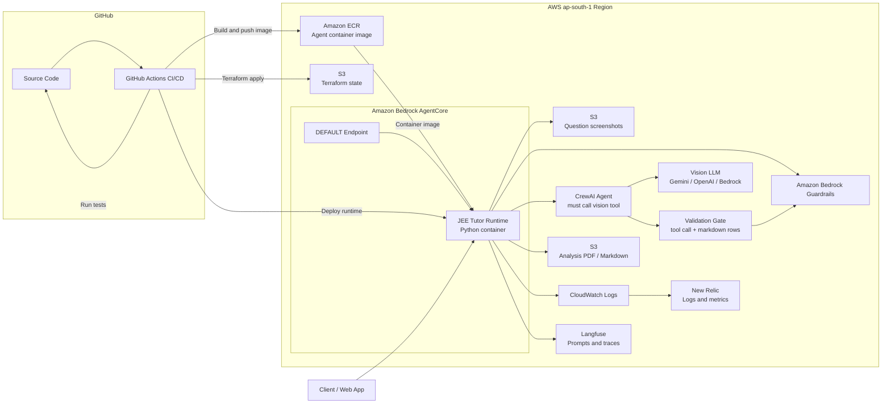

# JEE Tutor Agent Block Diagram

## Flow

1. GitHub Actions runs tests, builds the container image, pushes it to ECR, and applies Terraform.
2. Terraform creates the AgentCore runtime, IAM role, Bedrock Guardrail, CloudWatch logging, and related AWS resources.
3. The client invokes the AgentCore `DEFAULT` endpoint.
4. The runtime reads question screenshots from S3 or accepts a direct image data URI.
5. Bedrock Guardrails check input before the agent runs.
6. CrewAI must call the vision tool, which calls the configured vision LLM through LiteLLM.
7. The validation gate checks that the tool ran, row count matches image count, and markdown question numbers match S3 filenames.
8. Bedrock Guardrails check the validated output.
9. The runtime returns JSON analysis and optionally writes PDF/Markdown reports to S3.
10. Logs go to CloudWatch and optionally New Relic; prompts/traces go to Langfuse.
