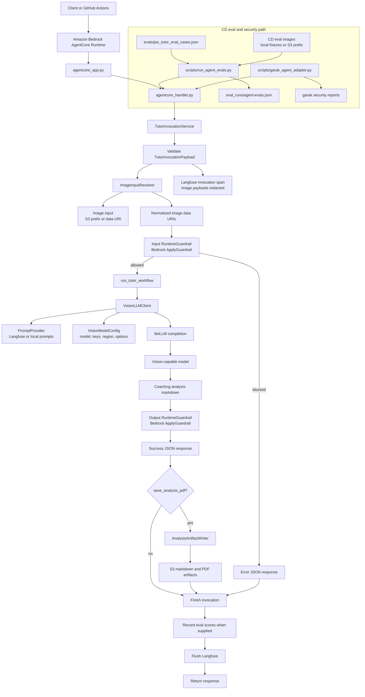

# JEE Tutor Agent Block Diagram

## Main Blocks

- Runtime edge: `agentcore_app.py` and `agentcore_handler.py` keep the Bedrock AgentCore contract thin.
- Invocation service: `TutorInvocationService` validates input, resolves images, applies guardrails, runs the workflow, writes optional artifacts, and finalizes observability.
- Tutor workflow: resolved image data URIs are sent directly to the LiteLLM-backed vision model call; missing images fail the invocation instead of falling back to text-only analysis.
- Safety: Bedrock runtime guardrails wrap both input and output.
- Evaluation: CD evals read `evals/jee_tutor_eval_cases.json`, invoke the same handler, and score the returned structure or guardrail behavior.
