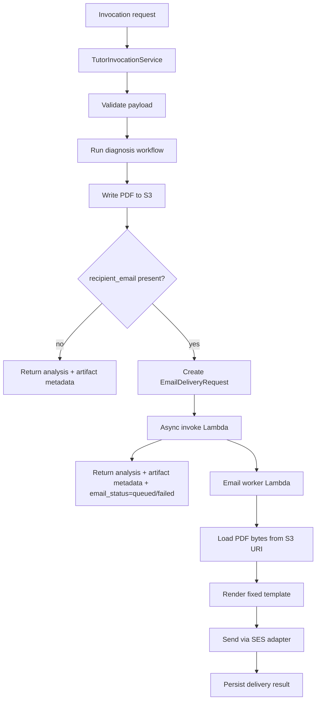

# Send Email After Analysis HLD

Status: Proposed

Source business spec:
[`send-email-spec.md`](send-email-spec.md)

## Purpose

Add an asynchronous email delivery path that sends the generated analysis PDF
to a caller-supplied recipient email address.

The implementation must preserve the existing diagnosis and PDF artifact flow:
the system still generates and stores the PDF even when no recipient is
provided.

## Design Goals

- Trigger email delivery only when `recipient_email` is present in the request.
- Keep PDF generation and S3 persistence on the normal invocation path.
- Avoid blocking the request on email delivery completion.
- Attach the existing PDF artifact rather than generating a second copy.
- Keep recipient data out of ordinary logs and traces.
- Preserve idempotent replay behavior.
- Keep the delivery backend simple.

## Non-Goals

- Multiple recipients.
- CC or BCC.
- Custom caller-provided email bodies or subjects.
- Synchronous delivery confirmation.
- Replacing the existing PDF artifact store.
- Changing diagnosis generation or validation.

## Proposed Architecture



## Runtime Flow

1. The invocation service validates the request.
2. The existing analysis workflow runs unchanged.
3. The artifact writer renders and stores the PDF in S3.
4. If `recipient_email` is absent, the invocation ends here.
5. If `recipient_email` is present, the service creates an email delivery job
   that includes:
   - recipient email
   - analysis PDF S3 URI
   - idempotency key or invocation identifier
   - configured subject/template identifiers
6. The runtime asynchronously invokes the Lambda worker after PDF persistence.
7. The invocation returns immediately after the email request is accepted or
   rejected.
8. An asynchronous worker later reads the PDF from S3 and sends the email with
   the PDF attached.

## Component Design

### 1. Invocation contract

Extend the existing invocation payload model with `recipient_email`.

Implementation requirement:

- `recipient_email` is optional.
- When present, it must validate as a real email address.
- The absence of `recipient_email` means no email is requested.

### 2. Invocation service

`TutorInvocationService` should remain the orchestration entrypoint.

Responsibilities:

- validate the payload,
- run analysis,
- call the artifact writer,
- decide whether an email request should be created,
- return a response that includes email delivery state.

The email decision should happen after the PDF URI is known so the downstream
job can reference the stored artifact directly.

### 3. Email delivery coordinator

Add a small application-layer component responsible for building and handing
off email work.

Suggested interface:

```python
class EmailDeliveryCoordinator(Protocol):
    def request_delivery(
        self,
        *,
        recipient_email: str,
        pdf_uri: str,
        invocation_id: str | None,
        subject_key: str,
    ) -> EmailDeliveryOutcome: ...
```

Responsibilities:

- construct a delivery request from existing invocation output,
- enforce idempotent request creation,
- avoid exposing recipient data in traces,
- report `queued`, `failed`, or `not_requested`.

The coordinator is an application-layer boundary, not an LLM tool. It should be
called only after the PDF artifact URI is available.

### 4. Email worker / provider adapter

The worker is the only part that talks to the actual email provider.

Responsibilities:

- resolve the configured sender identity,
- fetch the PDF bytes from S3,
- render the fixed body template,
- attach the PDF,
- send the message,
- record delivery success or failure.

The worker may be backed by SES or another provider later, but the application
code should depend on a provider-neutral adapter interface.

The worker must be idempotent for duplicate runtime invocations. If the same
delivery request is processed twice, the second execution should either no-op
or produce the same final delivery state without sending a second email.

Assume the async Lambda path can retry on transient invocation or execution
failures. The worker therefore must be safe to run more than once for the same
delivery request, and delivery deduplication must not rely on a single Lambda
attempt.

### 5. Artifact reuse

The existing PDF artifact remains the attachment source.

Current behavior already writes PDFs under the image S3 prefix. The email flow
should consume that same URI instead of creating a separate storage path.

If the artifact write fails, email delivery must not be attempted.

## Data Contracts

### Invocation payload

Add:

```json
{
  "recipient_email": "student@example.com"
}
```

### Email delivery request

Internal request shape should include:

- `recipient_email`
- `pdf_uri`
- `sender_config_key`
- `subject_config_key`
- `body_template_key`
- `idempotency_key`
- `invocation_commit_sha` or equivalent trace-safe identifier

Do not persist the raw invocation payload in the delivery job if it contains
image data or other sensitive fields.

## Configuration

Use deployment configuration for all sender and template controls.

Recommended env vars:

- `EMAIL_FROM_ADDRESS`
- `EMAIL_SUBJECT_TEMPLATE`
- `EMAIL_BODY_TEMPLATE`
- `EMAIL_REGION`
- `EMAIL_DELIVERY_PROVIDER`
- `EMAIL_DELIVERY_FUNCTION_ARN` or equivalent backend binding

The transport implementation may be chosen later, but the config surface should
already separate:

- message content
- provider selection
- async backend destination

## Idempotency Strategy

The email path needs its own duplicate suppression, independent of the
invocation idempotency store.

Retry policy:

- runtime async invoke may be retried on transient failure,
- Lambda may execute more than once for the same delivery request,
- SES send must be guarded by a stable delivery key,
- duplicate delivery requests must not send a second email.

Recommended behavior:

- if the invocation replays with the same idempotency key and the same
  `recipient_email`, reuse the prior email outcome,
- if the same invocation is replayed after a successful async invoke, do not
  invoke a second time,
- if the same invocation is replayed with a different recipient, treat it as a
  conflict through the existing invocation idempotency boundary.

The delivery request key should be derived from a stable tuple such as:

- invocation idempotency key
- recipient email
- analysis PDF URI

That key should be used to deduplicate async Lambda invocations and worker
execution.

## Failure Handling

### No recipient

- PDF generation still runs.
- No email job is created.
- Response should report `email_status=not_requested`.

### Invalid recipient

- Reject at payload validation time.
- Do not run the email worker.

### PDF generation failure

- Return the existing artifact error path.
- Do not invoke the worker.

### Async invoke failure

- Preserve the successful analysis and PDF artifact response.
- Return `email_status=failed`.
- Include a safe, bounded error message.
- Log a structured async-invoke failure event with the delivery key, invocation
  id, and sanitized error class.

### Worker delivery failure

- Mark the delivery job as failed.
- Capture safe provider error metadata.
- Do not expose raw provider payloads or recipient addresses in logs.
- Retry only if the failure is transient and the Lambda invocation policy
  supports retry.
- If SES returns a permanent failure, mark the delivery terminally failed.

### PDF fetch failure in worker

- Treat as worker failure.
- Record the PDF URI and safe error class.
- Do not retry indefinitely if the URI is invalid or the object is missing.

### Provider send failure

- Record provider error class and status code only.
- Do not log the raw SES response body unless it is explicitly sanitized.
- Return the job to a failed state after retry policy is exhausted.

## Observability

Add email-specific metrics and traces separate from analysis metrics.

Recommended metrics:

- `email_delivery_requested_count`
- `email_delivery_invoked_count`
- `email_delivery_failed_count`
- `email_delivery_succeeded_count`
- `email_pdf_fetch_failed_count`
- `email_delivery_duplicate_suppressed_count`
- `email_delivery_validation_failed_count`
- `email_delivery_async_invoke_retry_count`
- `email_delivery_provider_retry_count`

Trace requirements:

- record the PDF S3 URI,
- redact or hash recipient email,
- do not store attachment bytes,
- do not log body template content.

Logging requirements:

- log one structured event when the email request is accepted or rejected,
- log one structured event when the worker starts processing a request,
- log one structured event on worker success or terminal failure,
- include `delivery_id`, `invocation_id`, `analysis_pdf_uri`, `email_status`,
  and a sanitized error class,
- never log the recipient email in plaintext.

Metric dimensions should distinguish:

- invocation path versus worker path,
- validation failure versus async invoke failure versus provider failure,
- async invoke failure versus worker failure,
- success versus duplicate suppression,
- transient versus terminal failure.

## Security and Privacy

- Treat `recipient_email` as personal data.
- Keep the sender address and subject controlled by deployment config.
- Read PDF bytes only from the known S3 URI created by the invocation.
- Avoid creating any path where the caller controls the attachment source
  directly.
- Keep email body generation deterministic and template-driven.

## Testing Strategy

### Unit tests

- validation of `recipient_email`,
- no-email path when `recipient_email` is absent,
- email request creation when `recipient_email` is present,
- response mapping for `queued`, `failed`, and `not_requested`,
- idempotent replay behavior.

### Integration tests

- PDF artifact exists before email request creation,
- email path receives the PDF S3 URI,
- successful invocation with email request returns non-blocking response,
- failed async invoke does not erase analysis success.

### Regression tests

- existing invocation payloads without `recipient_email` still succeed,
- existing PDF artifact naming and storage remain unchanged,
- no extra image or analysis behavior changes are introduced.

## Rollout Plan

1. Add the payload field and response field behind backward-compatible logic.
2. Wire the email coordinator to the existing invocation service.
3. Keep the worker backend abstract until the provider choice is finalized.
4. Add tests for the no-recipient and recipient-present paths.
5. Deploy with the email path disabled or no-op if the backend is not yet
   configured.
6. Enable delivery in a staged environment and verify artifact reuse and
   idempotency.

## Definition of Done

- Invocation requests with `recipient_email` create a single async delivery
  request.
- Requests without `recipient_email` continue to behave exactly as before.
- The PDF artifact is still written to S3 in both paths.
- The email uses a fixed subject and fixed template.
- Duplicate retries do not create duplicate delivery requests.
- Logs and traces do not leak the raw recipient email or attachment bytes.
